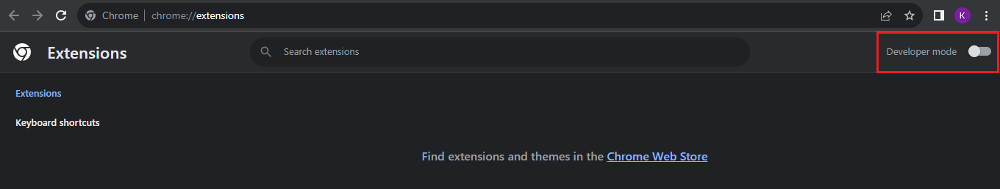
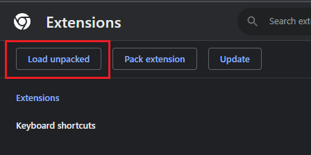
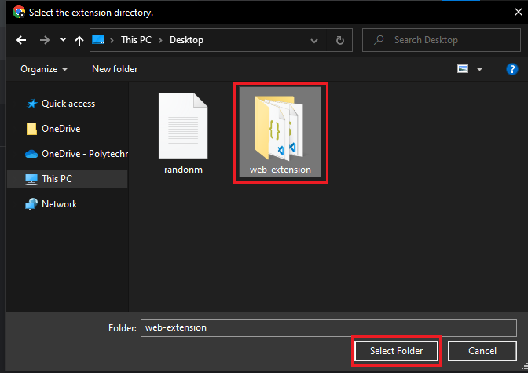
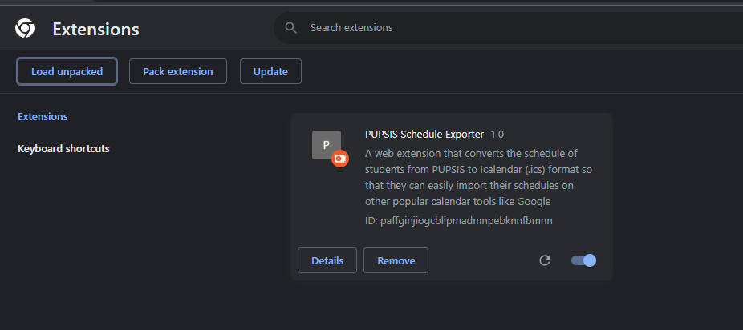

# PUPSIS-Schedule-Exporter

This branch is the testing branch for developers that plan to contribute on this repository. 

# How to setup extension for testing

1. Download Extension from the **Main branch**
2. Open [Test PUPSIS Schedule Page](src/School%20Year%202324%20-%20First%20Semester%20-%20PUPSIS.html) on your browser
3. on **manifest.json**, Add the file directory of the [Test PUPSIS Schedule Page](src/School%20Year%202324%20-%20First%20Semester%20-%20PUPSIS.html) on the **manifest.json matches list** as shown below:

        "matches": [
            "add the School Year 2324 - First Semester - PUPSIS.html directory here",
            "https://sis1.pup.edu.ph/student/schedule",
            "https://sis2.pup.edu.ph/student/schedule"
        ],

# Changes when opening a PR to main
### popup.js 

set **OVERRIDE_DEV to false**

    //set to false when pushing to main
    const OVERRIDE_DEV = true;

### manifest.json
Remove file directory from the **matches list** or paste the codeblock below

        "matches": [
            "https://sis1.pup.edu.ph/student/schedule",
            "https://sis2.pup.edu.ph/student/schedule"
        ],

# Installation guide for Developers:
#### 1. Click the **"Code"** button on this repository and then **"Download ZIP"**

#### 2. Extract the .zip file using WINRAR (or any apps for unzipping)

#### 3. Click the **three dots** on the upper right side of your browser   &nbsp;&nbsp;&nbsp; Click on **"Extensions"**   &nbsp;&nbsp;&nbsp; Click on **"Manage Extensions"**

#### 4. Click **"Developer Mode"** on the upper right

#### 5. Click **"Load Unpacked"** on the upper left

#### Then select the **"web-extension"** file that you extracted previously

   

#### Taa Daa! You can now use the extension on your browser!

