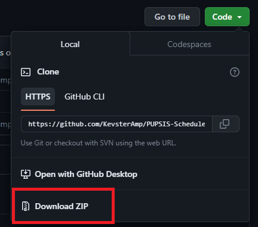
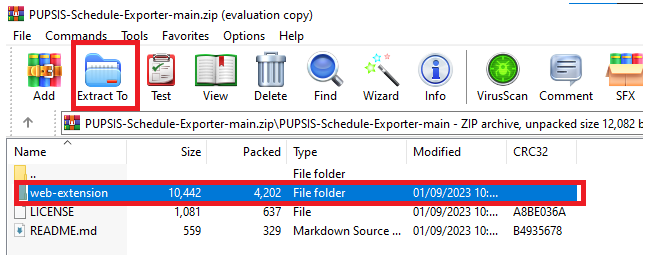
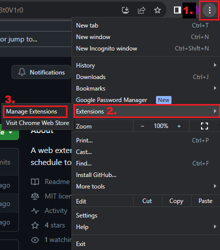
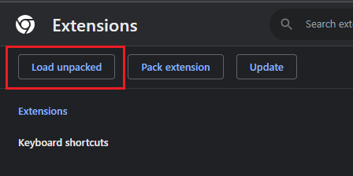
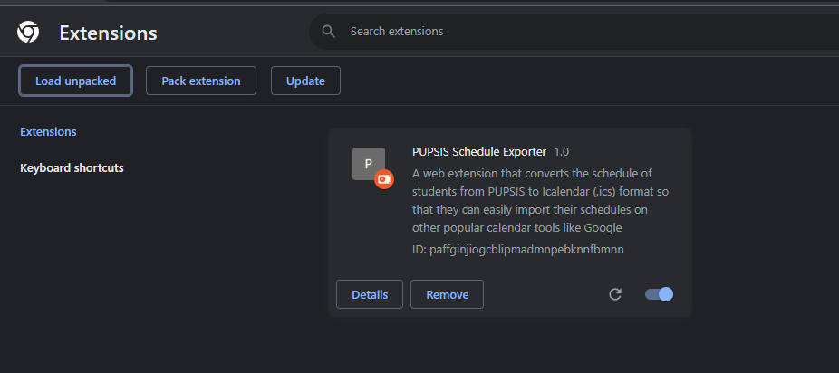
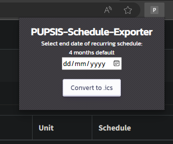

# PUPSIS-Schedule-Exporter
A web extension that converts the schedule of students from PUPSIS to Icalendar (.ics) format so that they can easily import their schedules on other popular calendar tools like Google Calendar.
   

This project aims to help PUP Students to easily sync their Schedules to their desired Calendar tools.

# Installation guide:
#### 1. Click the **"Code"** button on this repository and then **"Download ZIP"**

#### 2. Extract the .zip file using WINRAR (or any apps for unzipping)

#### 3. Click the **three dots** on the upper right side of your browser   &nbsp;&nbsp;&nbsp; Click on **"Extensions"**   &nbsp;&nbsp;&nbsp; Click on **"Manage Extensions"**

#### 4. Click **"Developer Mode"** on the upper right

#### 5. Click **"Load Unpacked"** on the upper left

#### Then select the **"web-extension"** file that you extracted previously

   

#### Taa Daa! You can now use the extension on your browser!

# Usage
#### Click the **"Extension Icon"** to locate the extension. 

#### This should pop up when you click the **"PUPSIS Scheduler Exporter"** extension.

#### You can now go to https://sis2.pup.edu.ph/student/schedule. Click the extension and the **"Convert to .ics"** button to download 
the ICalendar file (.ics)

# Features

### End Date of Recurring Schedule feature
By default, the generated ICalendar file (.ics) is recurring up to 4 months of the time it was downloaded.  
With this feature, Users have the option to choose when the recurring events should stop by setting an End Date in the ICalendar file.  
 
*Tip: it's a good idea to set the end date to the last day of their semester. This way, the recurring events will automatically stop when the semester ends.*

## TODO
- [x] Finish readme and introduction
- [x] Add guide, image tutorial 
- [ ] Add video tutorial
- [ ] Add image icons for web extension
- [x] Implement "End Date of Recurring Schedule" feature
- [x] Return error at empty schedule
- [ ] Implement CSV feature
- [x] Add Styling (Thanks egg-lou!)