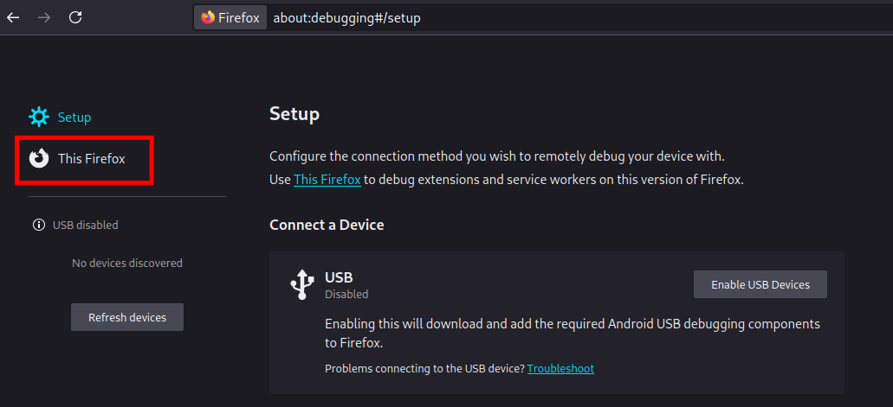

# Installation guide:
### Chrome / Microsoft Edge
#### 1. Click the **"Code"** button on this repository and then **"Download ZIP"**

#### 2. Extract the .zip file using WINRAR (or any apps for unzipping)

#### 3. Click the **three dots** on the upper right side of your browser   &nbsp;&nbsp;&nbsp; Click on **"Extensions"**   &nbsp;&nbsp;&nbsp; Click on **"Manage Extensions"**

#### 4. Click **"Developer Mode"** on the upper right

#### 5. Click **"Load Unpacked"** on the upper left

#### Then select the **"web-extension"** file that you extracted previously

   

#### Taa Daa! You can now use the extension on your browser!

## Firefox
> [!IMPORTANT]  
Due to [Mozilla's policy](https://extensionworkshop.com/documentation/publish/add-on-policies/), this extension cannot be published on the Mozilla Web Store (AMO). However, Firefox users can still use the extension by installing it as a **temporary add-on**.

#### 1. Click the "**"Releases"**" button on this repository and then download the file with "**.xpi**"

#### 2. Navigate in search bar and type "**about:config**"

#### 3.  Click **Accept the Risk and Continue** to proceed in config page

#### On search tab type `xpinstall.signatures.required` and toggle to `false`

#### 4. Navigate again in search bar and type `about:debugging` 

#### 5. Click the "**This Firefox**"

#### 6. Click the "**Load Temporary Add-on...**"

#### 5. Then select the **".xpi"** file you download earlier

#### 6. Click the **"Extension Icon"** to locate the extension.
 

#### This should pop up when you click the **"PUPSIS Scheduler Exporter"** extension.
>[!NOTE]
If the extension was missing after closing or restarting the browser, navigate again to `about:debugging` > Load Temporary Add-on and select again the .xpi you download

***
# Usage
#### Click the **"Extension Icon"** to locate the extension. 

#### This should pop up when you click the **"PUPSIS Scheduler Exporter"** extension.

#### You can now go to https://sis2.pup.edu.ph/student/schedule.  Click the extension and the **"Convert to .ics"** button to download the ICalendar file (.ics)
