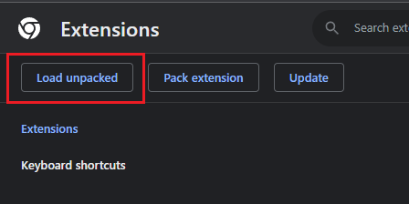
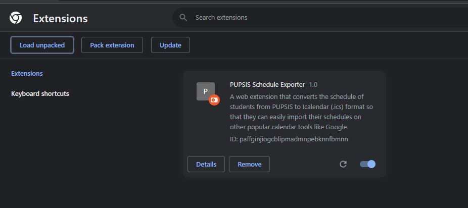

# Installation guide:
## Chrome
#### 1. Click the **"Code"** button on this repository and then **"Download ZIP"**

#### 2. Extract the .zip file using WINRAR (or any apps for unzipping)

#### 3. Click the **three dots** on the upper right side of your browser   &nbsp;&nbsp;&nbsp; Click on **"Extensions"**   &nbsp;&nbsp;&nbsp; Click on **"Manage Extensions"**

#### 4. Click **"Developer Mode"** on the upper right

#### 5. Click **"Load Unpacked"** on the upper left

#### Then select the **"web-extension"** file that you extracted previously

   

#### Taa Daa! You can now use the extension on your browser!

# Usage
#### Click the **"Extension Icon"** to locate the extension. 

#### This should pop up when you click the **"PUPSIS Scheduler Exporter"** extension.

#### You can now go to https://sis2.pup.edu.ph/student/schedule.  Click the extension and the **"Convert to .ics"** button to download the ICalendar file (.ics)

## Firefox
> **Important:**  
Due to Mozilla's policy, we're unable to publish this extension on Mozilla Add-ons (AMO). As a workaround, Firefox users can install the extension as a **temporary add-on** to run it.

#### 1. Click the "**"Releases"**" button on this repository and then download the file with "**.xpi**"

#### 2. Open firefox browser and navigate to search bar type "**about:debugging**"

#### 3. Click the "**This Firefox**"

#### 4. Click the "**Load Temporary Add-on...**"

#### 5. Then select the **".xpi"** you download earlier

#### 6. Click the **"Extension Icon"** to locate the extension. 

#### This should pop up when you click the **"PUPSIS Scheduler Exporter"** extension.

